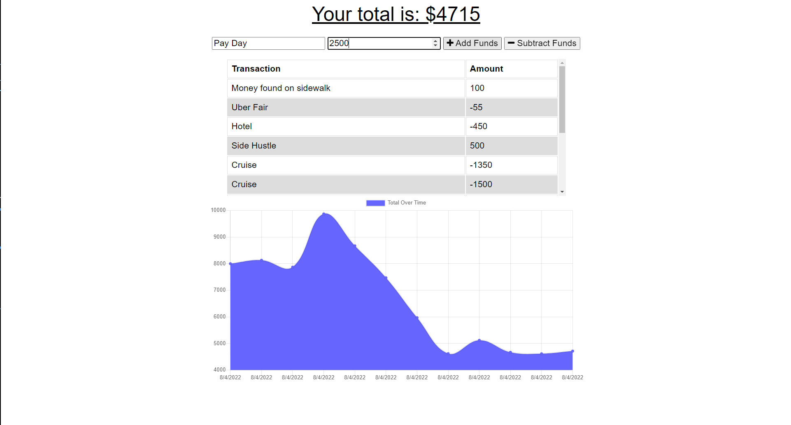
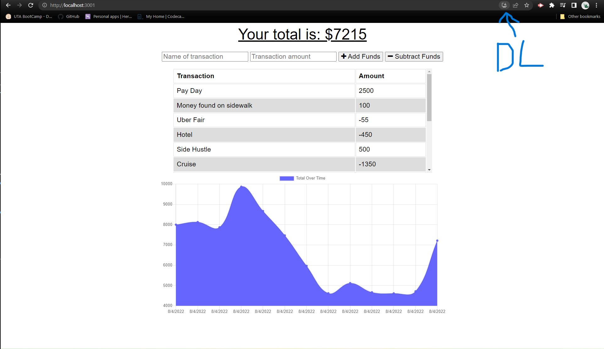

# Budget Unlimited

This budget allows you to update your budget any time anywhere, regardless of internet connection. Truly unlimited budgeting!

#### Deployed at: [https://budget-unlimited.herokuapp.com/](https://budget-unlimited.herokuapp.com/)

---

## Table of Contents

1. [Installation](#installation)

2. [Usage](#usage)

3. [License](#license)

4. [Questions](#questions)

---

## Installation

You can download this application directly to your device! If using a PC just click the download button that has appeared in the url after visiting the site, if on a mobile device the install option will be in the settings list.

## Usage

Simply enter the reason for your deposit or withdraw, and enter the amount. Then select the appropriate button whether to add or deduct funds. Then a graph displaying your budget trends wil be updated. No internet? No problem, your budget updates will be saved and updated once a connection is re-established!

---

---

## License

Copyright &copy; 2022 Chase Miller &lt;millerchase>

Permission is hereby granted, free of charge, to any person obtaining a copy of this software and associated documentation files (the "Software"), to deal in the Software without restriction, including without limitation the rights to use, copy, modify, merge, publish, distribute, sublicense, and/or sell copies of the Software, and to permit persons to whom the Software is furnished to do so, subject to the following conditions:

The above copyright notice and this permission notice shall be included in all copies or substantial portions of the Software.

THE SOFTWARE IS PROVIDED "AS IS", WITHOUT WARRANTY OF ANY KIND, EXPRESS OR IMPLIED, INCLUDING BUT NOT LIMITED TO THE WARRANTIES OF MERCHANTABILITY, FITNESS FOR A PARTICULAR PURPOSE AND NONINFRINGEMENT. IN NO EVENT SHALL THE AUTHORS OR COPYRIGHT HOLDERS BE LIABLE FOR ANY CLAIM, DAMAGES OR OTHER LIABILITY, WHETHER IN AN ACTION OF CONTRACT, TORT OR OTHERWISE, ARISING FROM, OUT OF OR IN CONNECTION WITH THE SOFTWARE OR THE USE OR OTHER DEALINGS IN THE SOFTWARE.

[https://opensource.org/licenses/MIT](https://opensource.org/licenses/MIT)

## Questions

For any additional questions, find me on GitHub @ [millerchase](https://github.com/millerchase)
